  
  
  

### 👋 Hi, I'm Tadas

Junior developer with a **Cybersecurity and Systems** degree (Kauno Kolegija, 2024). I build web apps, APIs, AI integrations and security tools, test them, and deploy them so people can actually use them.

🔍 **Currently:** looking for a junior developer or IT role · 🇱🇹 🇬🇧 🇷🇺 Lithuanian, English, Russian

### 🚀 Projects

| | Project | What it does | |
|:-:|---|---|---|
| 🛡️ | **[Website Security Checker](https://github.com/Tadas380/website-security-checker)** | A–F security grade, "fix first" list and PDF report for any website. SSRF-safe, PDF writer built from scratch, 22 tests | [Live ↗](https://website-security-checker-o8s7.onrender.com) |
| 🔎 | **[Subdomain Finder](https://github.com/Tadas380/subdomain-finder)** | Passive recon from Certificate Transparency logs, DNS checks and dangling-CNAME detection | [Live ↗](https://subdomain-finder-5s8z.onrender.com) |
| 💬 | **[AI Website Assistant](https://github.com/Tadas380/ai-website-assistant)** | Embeddable AI chat widget for business websites (Gemini API), lead capture and Discord alerts | [Live ↗](https://ai-website-assistant-k9c7.onrender.com) |
| 📊 | **[Subscriber Insights](https://github.com/Tadas380/subscriber-insights)** | Shopify embedded app: MRR, churn and at-risk subscribers with real-time Recharge webhooks | |
| 📅 | **[LT Calendar API](https://github.com/Tadas380/lt-calendar-api)** | Open REST API for Lithuanian name days and public holidays, zero dependencies, CI | |
| 🚌 | **Kaunas Transit Live** | Live map of Kaunas buses and trolleybuses | [Live ↗](https://kaunas-transit-live.onrender.com) |
| 🤖 | **[Price-Monitoring Bot](https://github.com/Tadas380/bot)** | Python bot that finds underpriced marketplace listings and sends Discord alerts, 62 tests | |

### 🧰 Tech I use

  
  
  
  
  
  
  
  
  
  
  

**Security:** input validation · rate limiting · HTTP security headers · TLS & DNS · SSRF protection · webhook signature verification

---

Every project above is open source and most have a live demo. More at <a href="https://tadas380.github.io/">tadas380.github.io</a>

